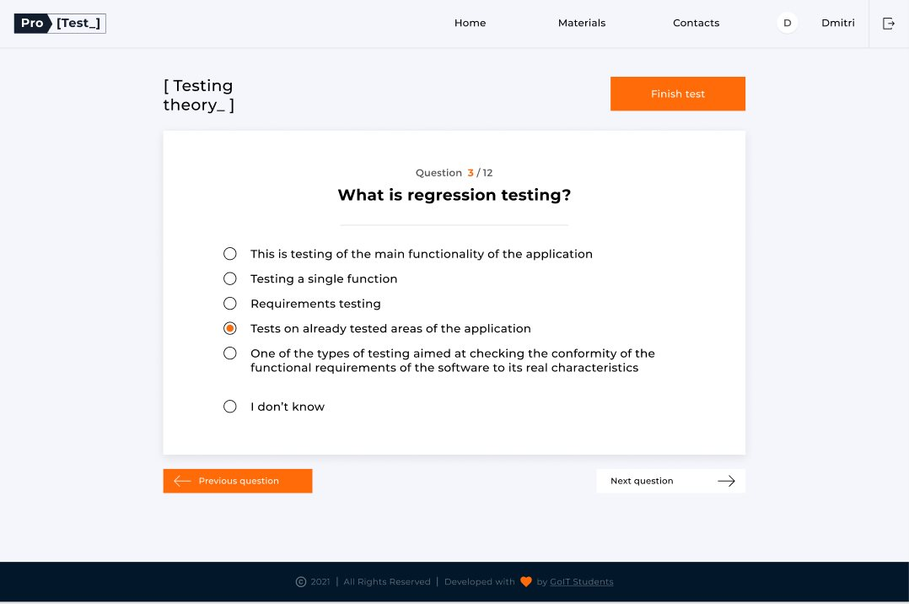

# GoIt-Test-Pro-Team11

### Цели проекта

Научиться с помощью командной работы создавать React приложение согласно
техническому заданию. По заданому макету написать фронт-энд, сделать адаптивную
верстку, связать с бэк-ендом. Применить современные технологии веб-разработки,
верстки и деплоя приложения.

### Общее описание функционала приложения

После регистрации, аутентификации и авторизации пользователя ему становиться
доступно прохождение тестов на знание выбраной области в IT-сфере, с дальнейшим
выводом результатов тестирования.

### Ключевые характеристики

- Регистрация и создание пользователя на бэк-енд сервере
- Аунтефикация и авторизация пользователя с помощью JWT токена на бэк-енде
- Приватные и публичные пути в приложении
- Использование библиотеки для управления состоянием (Redux)
- Получение рандомных тестовых вопросов с бэк-енда по выбраной тематике
- Отправка собраных ответов пользователя на бэк-енд
- Получение с бэк-енда результатов тестирования и отображение их пользователю

### Использованые технологии:

- React JavaScript
- React-Redux-Toolkit
- Redux-Persist

### Additional Libraries:

- Axios
- Material-UI
- React loader spinner
- React toastify

### Обзор приложения:

Приложение при первом посещении предлагает пользователю зарегистрироваться или
авторизироваться

После авторизации пользователя, ему становиться доступен выбор одного из тестов

После выбора теста пользователь начинает его проходить, отвечая на вопросы с
помощью радиокнопок

Завершив тест пользователю отобразиться результат тестирования

Также пользователю будут доступны страница с полезной информацией и страница
контактных даных команды разработчиков.

### Authors and Contributors

This project is the result of 11 member team work:

- Ярослав Василенко (Scrum master) Gloomy699
- Дробінко Костянтин (Team lead) DRAKOS6666
- Сивоненко Юлия Sivonenko
- Дмитрий Хомяков unstopDD
- Марина Ветох Vetokh-Marina
- Виктория Баранюк ViktoriiaBaraniuk
- Александр Чепак Alex-BC
- Михаил Ходак WerewolfDevLearn
- Рєзнік Денис reznik-denis
- Александр Холодняк AlexanderKholodnyak
- Сергей Степанов SerhiyStepanov
